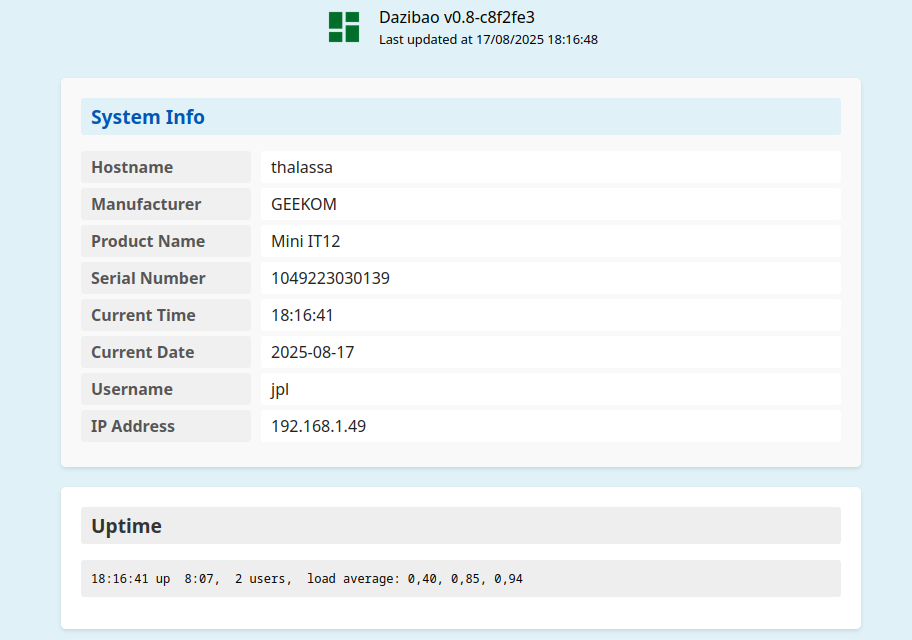

# Dazibao

Dazibao is a lightweight, Conky-like system monitoring tool that serves system information as a single, self-refreshing HTML page. It is designed to be highly configurable, allowing you to display custom command outputs in a clean, organized layout.

 *a capture of the rendered HTML page*

## Features

-   **Customizable Information Blocks:** Display the output of any shell command in configurable blocks.
-   **JSON Configuration:** All layout, commands, and colors are managed through a simple `config.json` file.
-   **Multiple Operating Modes:**
    -   **Server Mode:** Runs as a persistent web server that refreshes the page automatically.
    -   **Static Generation Mode:** Generates a single, self-contained HTML file.
    -   **Interval Generation Mode:** Periodically regenerates the static HTML file at a custom interval.
-   **Customizable Theming:** Control the background and text colors for the page, titles, labels, and values, and now also **font sizes** for these elements.
-   **Built-in Variables:** Use special variables like `%hostname`, `%time`, `%date`, and more for common system information without running external commands.

## Installation

To build Dazibao, simply run the build script from the project root. This will compile the Go program and create an executable named `dazibao` in the current directory.

```bash
./build.sh
```

The first time you run the application, it will automatically create a `~/.dazibao` directory in your home folder and populate it with a default `config.json`, the necessary HTML template, and icons.

## Configuration

Dazibao is configured through the `~/.dazibao/config.json` file. You can customize the blocks, commands, and colors to your liking.

### Block Types

-   **`single`:** Displays the output of a single command.
-   **`group`:** Displays the output of multiple commands, each with its own label.

### Font Size Customization

You can specify font sizes for different elements within a block using the following optional properties in the `colors` object:

-   `"title_font_size"`: Sets the font size for the block title (e.g., `"1.5em"`, `"24px"`).
-   `"label_font_size"`: Sets the font size for labels in group blocks (e.g., `"1em"`, `"16px"`).
-   `"value_font_size"`: Sets the font size for command outputs/values in both single and group blocks (e.g., `"1.2em"`, `"18px"`).

### Example `config.json`

```json
{
  "blocks": [
    {
      "type": "single",
      "title": "Uptime",
      "command": "uptime",
      "interval": 5,
      "colors": {
        "background": "#fff",
        "title_color": "#333",
        "title_background": "#eee",
        "value_font_size": "1.5em"
      }
    },
    {
      "type": "group",
      "title": "System Info",
      "commands": [
        { "label": "Hostname", "command": "%hostname" },
        { "label": "Current Time", "command": "%time" },
        { "label": "Current Date", "command": "%date" }
      ],
      "interval": 5,
      "colors": {
        "background": "#f9f9f9",
        "label_background": "#f0f0f0",
        "label_font_size": "1.1em",
        "value_font_size": "1em"
      }
    }
  ],
  "port": 8080,
  "colors": {
    "page_background": "#f0f0f0"
  }
}
```

## Usage

Dazibao has three modes of operation, controlled by command-line flags.

### 1. Server Mode (Default)

This is the default mode. It starts a web server that serves the `index.html` page, which automatically fetches and refreshes its data.

**To start the server:**

```bash
./dazibao
```

You can then access the Dazibao page at `http://localhost:8080` (or the port specified in your `config.json`).

### 2. Dry Run Mode (Static Page Generation)

This mode generates a single, self-contained HTML file with the current system data and prints it to the console or saves it to a file. This is useful for testing your configuration or for capturing a snapshot of the system state.

**To print the HTML to the console:**

```bash
./dazibao -d
```

**To save the HTML to a specific file:**

Use the `-o` flag to specify an output path.

```bash
./dazibao -d -o /tmp/dazibao_snapshot.html
```

### 3. Interval Generation Mode

This mode acts as a static site generator, periodically creating a new `index.html` file with updated data at a specified interval. It does not run a web server.

**To regenerate the default `~/.dazibao/index.html` every 10 seconds:**

Use the `-t` flag to specify the interval in seconds.

```bash
./dazibao -t 10
```

**To regenerate a file at a custom path every 30 seconds:**

Use the `-o` flag to specify the output path.

```bash
./dazibao -t 30 -o /var/www/html/dazibao.html
```

The program will run until you stop it with `Ctrl+C`.

## License

This project is licensed under the GNU General Public License - see the [LICENSE.md](LICENSE.md) file for details.
